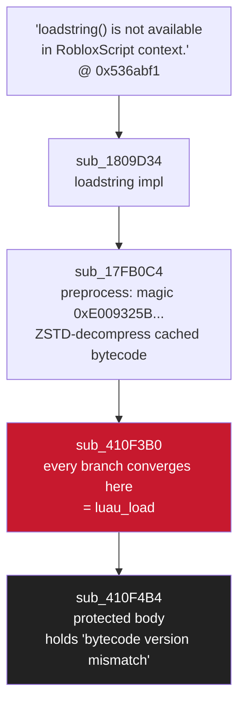
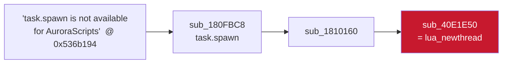
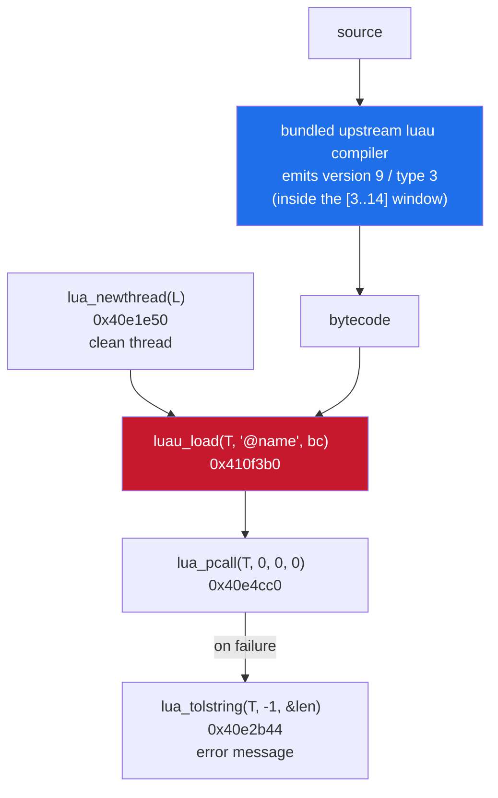

<h1 align="center">roblox-ios-luau-vm-notes</h1>

<p align="center">reverse engineering the luau vm inside ios roblox — the functions, the anchors, the layout</p>

<p align="center">
  
  
  
  
</p>

---

notes from reversing roblox's luau runtime on ios. no symbols, no cross-references,
a 74 mb stripped binary — this is the map: which functions matter, the strings they
anchor on, how to walk to them, and the `lua_State` layout you need to drive them.

> every address here is an rva in `RobloxLib` (ida loads it at base `0x0`).

---

## contents

- [the binary](#the-binary)
- [the functions](#the-functions)
- [finding `luau_load`](#finding-luau_load)
- [finding `lua_pcall`](#finding-lua_pcall)
- [finding `lua_newthread`](#finding-lua_newthread)
- [finding `lua_tolstring`](#finding-lua_tolstring)
- [the `lua_State` layout](#the-lua_state-layout)
- [from these functions to a working executor](#from-these-functions-to-a-working-executor)
- [notes](#notes)

---

## the binary

roblox on ios is split in two:

| image | `__text` | what's in it |
|---|---|---|
| `Roblox` | ~5.9 mb | thin swift/objc launcher, no luau strings |
| `RobloxLib.framework/RobloxLib` | **74 mb** (`0x4000`–`0x4a140b4`) | the whole luau vm |

`__cstring` sits at `0x5247700`–`0x55b8744`.

> [!NOTE]
> **there is no byfron / hyperion on ios.** searched, absent. no vm protector — the
> only real problem is that ida's auto-analysis does **not** build xrefs for most of
> `RobloxLib`. you can't "jump to xref"; you brute-scan `__text`, or anchor on a
> string that *does* keep a reference and walk the call graph by hand.

---

## the functions

the core of the luau c-api, verified in ida:

| function | rva | signature |
|---|---|---|
| `luau_load` | `0x410f3b0` | `int(lua_State*, const char* chunk, const char* data, size_t len, int env)` |
| `luau_load` body | `0x410f4b4` | protected inner — reads the bytecode version byte |
| `lua_pcall` | `0x40e4cc0` | `int(lua_State*, int nargs, int nresults, int errfunc)` |
| `lua_newthread` | `0x40e1e50` | `lua_State*(lua_State*)` |
| `lua_tolstring` | `0x40e2b44` | `const char*(lua_State*, int idx, size_t* len)` |
| gc step | `0x40f30fc` | `uint64(lua_State*, int)` — fires every interpreter tick |

how each was found is below.

---

## finding `luau_load`

the obvious anchor is the version-mismatch string:

```
"%s: bytecode version mismatch (expected [%d..%d], got %d)"   @ 0x550cf43
```

it has **no xref and no ADRP+ADD** a full `__text` page-scan can find — the compiler
groups format strings on a shared page and reaches them by `base + offset`
arithmetic, not statically greppable. a scan for a raw 64-bit pointer to it turns up
nothing either. dead end from the string side.

so anchor from `loadstring` instead — its error string keeps a real ref:



`sub_410F4B4` is the deserializer. its prologue reads the version byte and bails on
anything that isn't valid bytecode — this is what rejects raw source text:

```c
v5 = *(unsigned __int8 *)input;               // first byte = bytecode version
if ( *input == 0 ) { ...error... }            // 0 = compile-error stub
v6 = v5 == 100 || v5 - 15 > 0xFFFFFFF3;       // accept version in [3..14]
if ( !v6 )
    error("%s: bytecode version mismatch (expected [%d..%d], got %d)", name, 3, 14, v5);
```

`sub_410F3B0` wraps it in a protected call and marshals the arguments:

```asm
sub_410F3B0:
    SUB   SP, SP, #0xA0
    STP   X26, X25, [SP,#...]
    ...
    MOV   X20, X4          ; env
    MOV   X21, X3          ; len
    MOV   X22, X2          ; src / bytecode
    ; (X0 = lua_State, X1 = chunkname)
```

`int(lua_State* L, const char* chunkname, const char* data, size_t len, int env)` →
`0` ok, non-zero on error with the message left on the stack. note it takes
**bytecode**, not source — feed source and you get "bytecode version mismatch".

---

## finding `lua_pcall`

anchor on the vm's type-error string:

```
"attempt to call"   @ 0x550bce8
   └─ sub_40F0AD0        tiny luaG_typeerror helper (not the vm)
        └─ luaV_execute  sub_4105C34 / sub_410A444   (the two ~0x47xx-byte interpreter loops)
```

the protected-call core is `luaD_pcall` = `sub_40F25FC`: saves the stack/callinfo,
runs a setjmp-protected callback, unwinds and returns a status. the one small caller
that packages a `CallS { func, nresults }` is the public api:

```c
// sub_40E4CC0 = lua_pcall(L, nargs, nresults, errfunc)
v15 = *(_QWORD*)(L + 88) + 16 * ~nargs;      // func = top - (nargs+1)
v16 = nresults;
v9 = sub_40F25FC(L, sub_40E4DAC, &v15, ...); // luaD_pcall( ... luaD_call ... )
```

```asm
sub_40E4CC0:
    SUB   SP, SP, #0x30
    ...
    MOV   X19, X0
    LDR   X8, [X0,#0x40]     ; L->ci
    LDR   X9, [X8,#8]
    LDR   X20, [X9]
```

---

## finding `lua_newthread`

`task.spawn`'s binding creates a coroutine — trace it:



`sub_40E1E50(L)` allocates a thread (`sub_40FBDA0`), pushes it on `L`'s stack as a
`TTHREAD` value (type tag `10`), bumps top by 16, and returns the new `lua_State*`.
exactly `lua_State*(lua_State*)`.

---

## finding `lua_tolstring`

reachable from `sub_40E6984` (`lua_tovalue`-ish). the real converter is
`sub_40E2B44(L, idx, size_t*)`: resolves the value at `idx`, coerces it with
`sub_4110D84` (luaV_tostring), returns `*(TValue)+24` (the string data) and writes
the length through the third arg. use it at `idx = -1` to read the error message a
failed `pcall` leaves on the stack.

---

## the `lua_State` layout

picked up along the way:

```
L + 0x28   →  userdata / ExtraSpace        (sub_62757C: return *(L+40))
L + 0x40   →  current CallInfo
L + 0x58   →  stack top
*(*(L+0x28) + 0x90)  →  the thread's security identity object
```

> [!IMPORTANT]
> a chunk loaded on a thread **inherits that thread's identity** — the loaded closure
> takes its security context from `*(*(L+0x28)+0x90)`. so if you already hold a
> high-identity thread, anything you run on it is elevated for free; no separate "set
> identity" step.

the `ScriptContext` reflection string `@ 0x524e66b` *does* have xrefs, but they land
in `sub_18A644` — a **class-descriptor registrar** (reflection metadata), not a live
instance. that route is a dead end for reaching a real `lua_State`.

---

## from these functions to a working executor

the pieces above are enough to compile → load → run luau at runtime:



- `compile(src) → bytecode` — the client compiler isn't exposed; `loadstring` only
  deserializes cached bytecode (magic `0xE009325B...`, ZSTD), so **bundle the upstream
  luau compiler**. it emits version 9 / type 3, inside the `[3..14]` / `[1..3]` window
  `0x410f4b4` accepts.
- `lua_newthread(L)` (`0x40e1e50`) — a clean thread; the captured thread's stack top
  is game state, so `pcall` on it calls the wrong value.
- `luau_load(T, "@name", bc)` (`0x410f3b0`)
- `lua_pcall(T, 0, 0, 0)` (`0x40e4cc0`)
- `lua_tolstring(T, -1, &len)` (`0x40e2b44`) — the error message on failure.

> [!IMPORTANT]
> **thread-safety:** a `lua_State` can't be touched from another thread while the vm
> runs. hook the **gc step** (`0x40f30fc`) — it fires every interpreter tick, always
> on the vm thread — and do all of the above from there. capture `L` by hooking
> `luau_load` and snapshotting arg0 the first time the game loads any chunk.

---

## notes

- every rva is tied to the roblox build it was reversed against. updates move them;
  the string anchors above make re-finding them a walk, not a hunt.
- no protector, no server, no memory writes to `.text` — pure read + call.

---

<p align="center">
  <sub><b>more from me:</b> <a href="https://github.com/shiedless/ios-ue4-re">ios-ue4-re</a> · <a href="https://github.com/shiedless/unity-il2cpp-esp-tutorial">unity-il2cpp-esp-tutorial</a> · <a href="https://github.com/shiedless/ios-messiah-re">ios-messiah-re</a> · <a href="https://github.com/shiedless/ida-pro-guide">ida-pro-guide</a> · <a href="https://github.com/shiedless/Reveal">Reveal</a></sub>
</p>

---

<p align="center">— shiedless</p>
